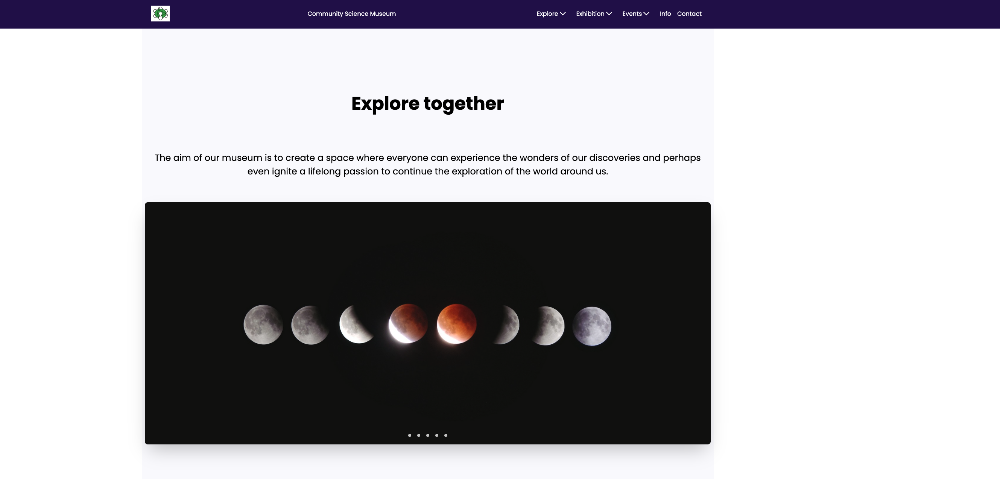

# Community Science Museum

My first project semester exam at Noroff, Frontend Development.

## Description

The aim of this project is to use our knowledge of project planning, web design and development to complete the brief in the available time.
An interactive science museum called the *Community Science Museum* is opening soon near our location. Its core target audience is primary and middle school children (ages 7-15) and families with young children.

## Built With

- HTML
- CSS
- Figma

## Getting Started

Links: 

[Website deployed via Netlify](https://communitysciencemuseum-mohammedabi.netlify.app)

Figma High fidelity wireframe:

 - [Figma style guide](https://www.figma.com/file/OQF3jFgE811hR1zW0uhy6x/Untitled?type=design&node-id=2%3A94&mode=design&t=V6fvvMUHKdqKY5n7-1)

 - [Desktop](https://www.figma.com/proto/OQF3jFgE811hR1zW0uhy6x/Untitled?page-id=0%3A1&type=design&node-id=2-94&viewport=1725%2C14656%2C0.42&t=oMqF9FrOYIAJ3zI3-1&scaling=scale-down&starting-point-node-id=2%3A94&mode=design)

 - [Mobile](https://www.figma.com/proto/OQF3jFgE811hR1zW0uhy6x/Untitled?page-id=0%3A1&type=design&node-id=315-1371&viewport=1379%2C8651%2C0.25&t=Zb7hnyxFdP4wLuC1-1&scaling=scale-down&starting-point-node-id=315%3A1371&show-proto-sidebar=1&mode=design)

 - [Project Kanban board showing project progress](https://github.com/users/MohammedAbi/projects/2/views/2)

### Installing

## Contributing

## Other projects Hosted on Netlify
 - [Rainy Day's](https://rainydays-mohammedab.netlify.app/)

## Contact
- [My LinkedIn page](https://www.linkedin.com/in/mohammedabdulabi/) 

## Acknowledgments

- Image Description Generator
[Pallyy's Image Description Generator](https://pallyy.com/tools/image-description-generator)

[Ahrefs' Image Alt Text Generator](https://ahrefs.com/writing-tools/img-alt-text-generator)

[Image Slider Tutorial](https://www.youtube.com/watch?v=McPdzhLRzCg&list=PLf9jWAVTVXo_pkSMDn3GFQBqNpS2mSPVg&index=41)

[Media Queries And Responsive Web Design Tutorial](https://www.youtube.com/watch?v=K24lUqcT0Ms&list=PLf9jWAVTVXo_pkSMDn3GFQBqNpS2mSPVg&index=27&t=40s)

[Meta Description Tool - ChatGPT](https://chat.openai.com/auth/login)